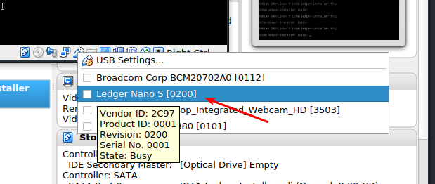

# Intro

You're about to install the Amoveo beta app on the Ledger Nano S using this installer.

This installer is heavily based on the original one from https://github.com/IOTA-Ledger/blue-app-iota-loader-alpine

See [ledger-app-veo GitHub repository](https://github.com/amoveo-project/ledger-app-veo) for the original source code.

See [Ledger's documentation](http://ledger.readthedocs.io) to get more info about the inner workings.

While we've made it as easy as possible to install the Amoveo application, it still requests some technical know-how, so be patient and read along!

## Requirements

Make sure that your Ledger Nano S is running firmware 1.6.1. 
For update instructions see: [How to update my Ledger Nano S firmware](https://support.ledger.com/hc/en-us/articles/360002731113)

## Installation of VirtualBox

We are using VirtualBox (a virtual computer running in your own operating system) along with a prebuild 'image' (also known as a VM) of an operating system that has everything you need to install Amoveo on the Ledger. This makes sure that no matter what you run (Windows, Mac, Linux etc) installation is guaranteed to work.

The application is free and opensource.

- Download VirtualBox here: https://www.virtualbox.org
- Now install it according to the steps given for your OS.
- Download Oracle VM VirtualBox Extension Pack to enable USB 2.0 ports in your virtual machine from https://www.virtualbox.org/wiki/Downloads
- Install it into VirtualBox: File → Preferences → Extensions → Add new package

## Download the Amoveo VM Installer Image

You can download the latest version of the Amoveo VM Installer Image here: [Releases](https://github.com/amoveo-project/veo-ledger-app-loader/releases) (Download VEO-Ledger-Nano-App-Loader.ova)

- Open VirtualBox
- In VirtualBox, click "File" > "Import Appliance"
- Browse to "VEO-Ledger-Nano-App-Loader.ova"
- Click "Next"
- Click "Import"

## Installation on the Ledger

- Plug in your Ledger device and enter your pin (you can leave it at the dashboard)
- Open VirtualBox
- Now select the new VM in the list on the left
- Click "Start"
- Please note, if the virtual machine borrows your mouse/keyboard, simply press the 'host' button to return control to your main operating system. By default it's Right Control on Windows/Linux and Right Command on Mac. The virtual machine will tell you what button it is in the bottom right corner when it is running.
- In VirtualBox, click the little USB icon on the bottom right and select the Ledger from the menu. This allows the VM to access the Ledger. 

If VirtualBox keeps saying that it failed to attach your device or even doesn't list your Ledger, try to use another USB port and check that you're using data transfer enabled USB cable.

- Wait until the VM starts downloading the app

During installation you are asked to insert your pin and asked to install an unofficial Ledger-application. Enter your pin and accept the warning by Ledger (the reasons for this warning is because our application is not released on the Ledger-store yet).

After the installation is done, you should see your Amoveo app on the dashboard!

## Congratulations!

If it worked! Otherwise, feel free to head to issues and ask for help.

You can now continue to use the Ledger Nano S with https://myveowallet.com.

### As a developer
Would you like to contribute as a dev? Please check out our [Telegram channel](https://tlg.name/amoveo_wallet) to contact us!
